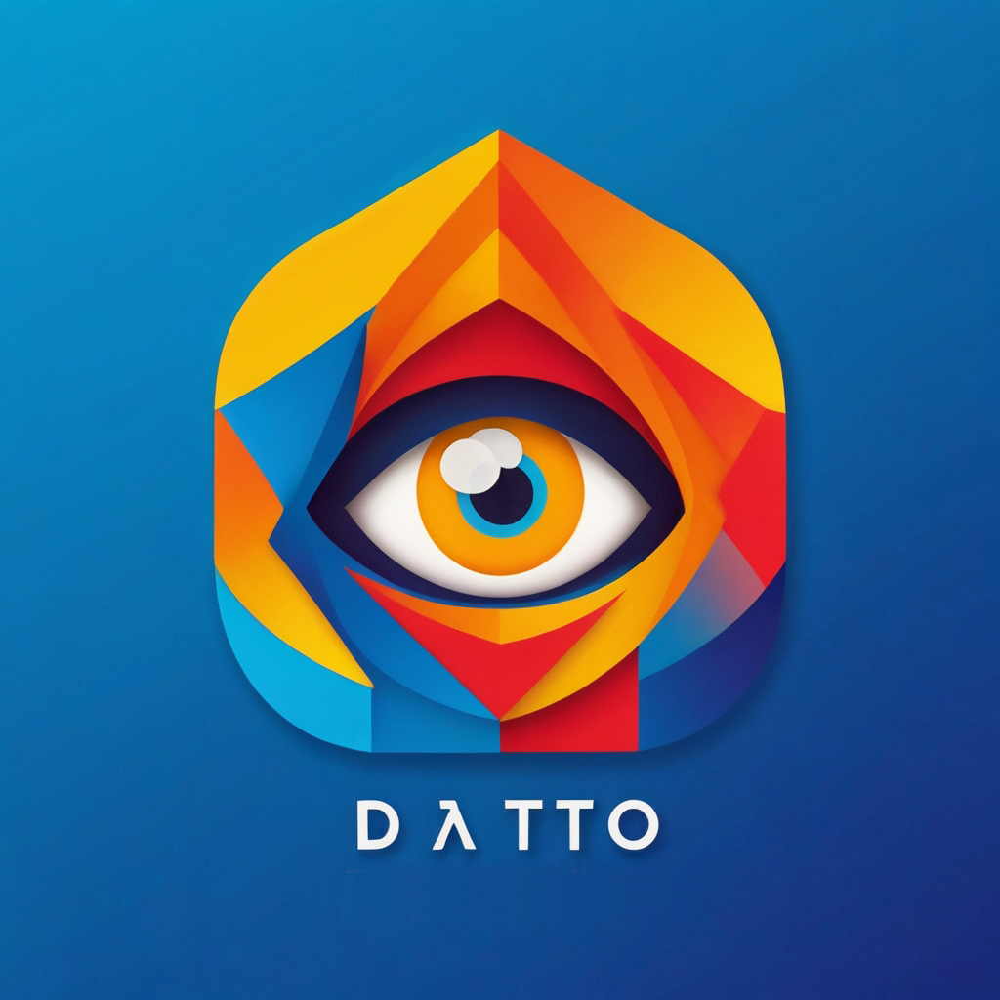

DATTO Calendar App is a simple yet powerful calendar application that allows users to manage your events efficiently. 

It comes in two versions: a command-line interface (CLI) and a graphical user interface (GUI) powered by Streamlit. 

## Features 

Add, remove, and modify events 
View events for different time intervals
User-friendly interface in both CLI and GUI versions 

## Installation 

1. Clone the repository

```bash
git clone https://github.com/meryantona/datto-calendar.git
cd datto-calendar
```

2. Install the required dependencies

```bash
pip install -r requirements.txt
```

## Usage 

### CLI Version 
Run the CLI version with:`

```bash
python3 datto_cli.py
```

Follow the on-screen prompts to manage your events.

### GUI Version 
Run the Streamlit GUI version with:`

```bash 
streamlit run datto_gui.py
```

This will open the app in your default web browser. 

## Dependencies 

- Python 3.7+ 
- Streamlit 
- SQLite3 

## Contributing 
Contributions are welcome! Please feel free to submit a Pull Request. 

## License 
This project is licensed under the MIT License - see the LICENSE file for details.